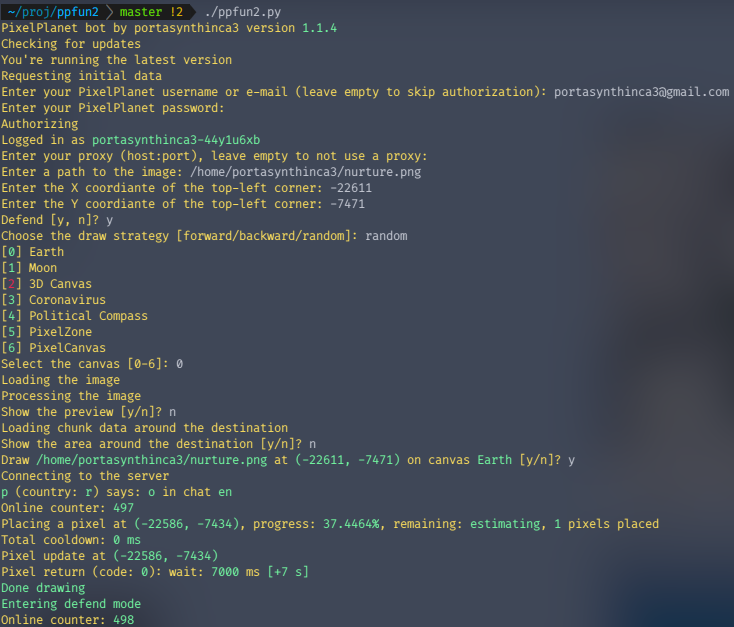
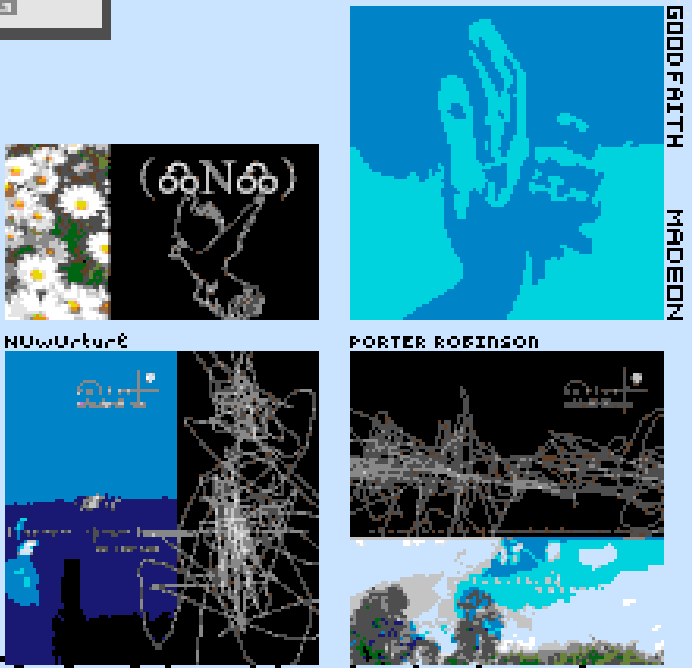

# ppfun2
**ppfun2** is a [PixelPlanet.Fun](https://pixelplanet.fun/) bot.

It draws and defends images automatically. You only need to enter captcha occasionally when the bot plays a sound notification.

# Setting up
1. Click the green button with a download icon and a `Code` text in it. Click `Download ZIP`. Download the ZIP archive and unpack it. You will only need `notif.mp3` and `ppfun2.py` files, the rest can be deleted. Alternatively, if you have Git installed, run `git clone https://github.com/portasynthinca3/ppfun2.git`
2. Install Python
    1. Windows. [Download](https://www.python.org/downloads/) an installer. Run it. Be sure to check the `Add Python to PATH` checkmark on the first screen.
    2. Linux. Depends on your distribution and the packet manager you use. For most popular distros including Ubuntu it's `sudo apt install python`, for Manjaro it's `sudo pacman -S python`.
3. Open the terminal/command line
4. Install the libraries: `pip install websockets opencv-python colorama playsound`
    1. note: I might have forgotten some libraries. In this case, if the program displays a message like `no module named xyz`, please run `pip install xyz` (`xyz` being the module name), and report this to me.
5. Navigate to the directory you unpacked the archive in step 1 into. You can do that using the `cd` command.
6. Run the bot: `python ppfun2.py`.
7. Follow the instructions. Don't close the command line or the terminal while the bot is running. You still can minimize it, however.
8. When you hear a breaking pickaxe sound from Minecraft, open PixelPlanet in your browser and place a pixel somewhere. You will be asked to enter CAPTCHA. Enter it, and the bot should continue drawing/defending.

# It doesn't work
It would be nice if you could send me the exact text the bot outputs through Issues on GitHub, in Discord (`portasynthinca3#1746`), or through E-Mail (`portasynthinca3@gmail.com`). Feature requests are also accepted.